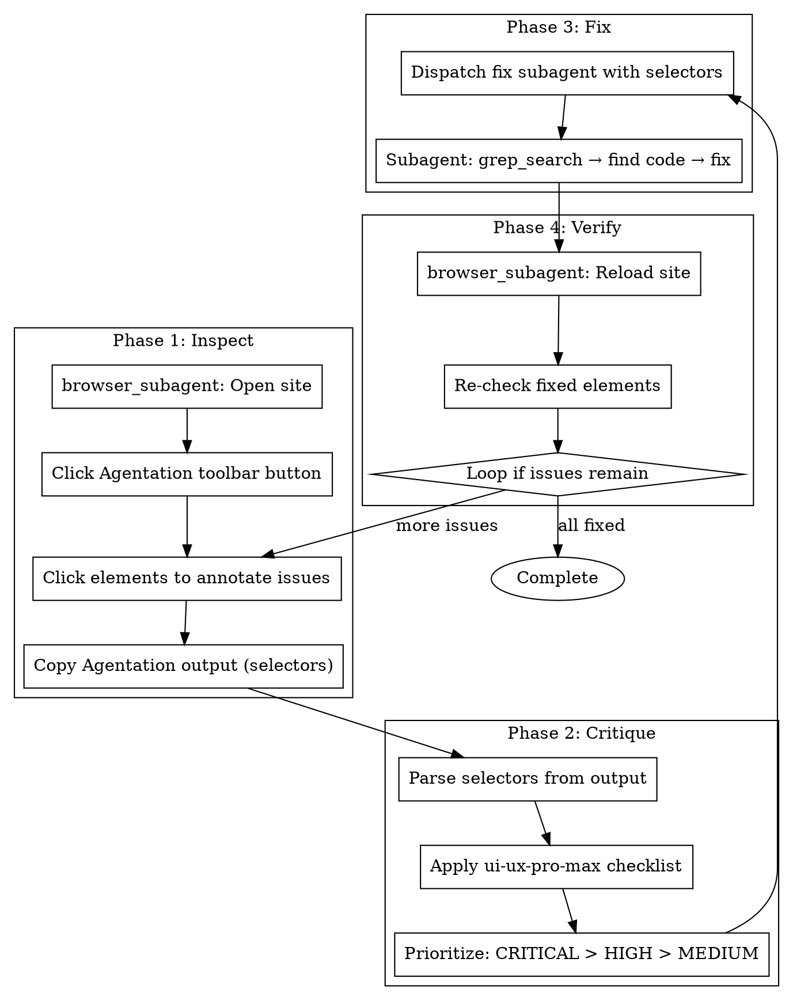

# Autonomous Critique & Refinement

## Overview

Fully autonomous UI/UX critique: browser_subagent opens site → uses Agentation toolbar → captures CSS selectors → applies ui-ux-pro-max rules → dispatches fix subagent → verifies.

**Core principle:** The agent surfs the site autonomously, uses Agentation to get precise selectors, then fixes issues per ui-ux-pro-max guidelines.

## Prerequisites

**Agentation must be installed in the project:**
```bash
npm install agentation -D
```

And added to the app (see `agentation` skill for setup).

---

## The Autonomous Workflow



---

## Phase 1: Surf and Annotate with Agentation

### Step 1: Open Site and Activate Agentation

```javascript
browser_subagent({
  TaskName: "Open Site with Agentation",
  Task: `Navigate to http://localhost:3000 (or the running dev server)
         
         1. Wait for page to fully load
         2. Look for Agentation floating button (bottom-right corner)
         3. Click the Agentation button to activate annotation mode
         
         If Agentation button is not visible:
         - Check if NODE_ENV is development
         - Verify agentation is installed
         
         Return: Confirmation that Agentation is active`,
  RecordingName: "activate_agentation"
});
```

### Step 2: Surf and Annotate Issues

```javascript
browser_subagent({
  TaskName: "Annotate UI Issues",
  Task: `With Agentation active, surf the site and annotate issues:
         
         Apply ui-ux-pro-max rules while surfing:
         
         CRITICAL (must annotate):
         - Buttons/links without cursor-pointer
         - Low contrast text (looks faded)
         - Missing focus states (tab through elements)
         - Touch targets too small
         
         HIGH (should annotate):
         - Font size < 16px on body text
         - Horizontal scroll on mobile viewport
         - Inconsistent spacing/alignment
         
         MEDIUM (nice to annotate):
         - Emoji used as icons (should be SVG)
         - Hover states that shift layout
         - Slow/missing transitions
         
         For each issue found:
         1. Click the element with Agentation
         2. Add annotation describing the issue
         3. Reference the ui-ux-pro-max rule
         
         When done: Click copy button to get structured output
         
         Return: The Agentation markdown output with all annotations`,
  RecordingName: "annotate_issues"
});
```

---

## Phase 2: Parse and Prioritize

After receiving Agentation output, parse the selectors:

```markdown
## Agentation Output Received

### Annotation 1
**Selector:** `.hero-section > .cta-button`
**Annotation:** Missing cursor-pointer (ui-ux-pro-max: cursor-pointer)

### Annotation 2
**Selector:** `.footer > .nav-links > a`
**Annotation:** Low contrast text (ui-ux-pro-max: color-contrast)
```

Prioritize by ui-ux-pro-max severity:
1. **CRITICAL** issues first
2. **HIGH** issues second
3. **MEDIUM** issues last

---

## Phase 3: Dispatch Fix Subagent

Use selectors for precise code location:

```markdown
## Fix Task for Subagent

I've annotated issues using Agentation. Fix them using the selectors:

### Issue 1 (CRITICAL)
**Selector:** `.hero-section > .cta-button`
**Rule Violated:** cursor-pointer
**Fix:** Add `cursor-pointer` class

**Find with:**
```bash
grep_search --query "cta-button" --includes "*.tsx"
grep_search --query "hero-section" --includes "*.tsx"
```

### Issue 2 (CRITICAL)
**Selector:** `.footer > .nav-links > a`
**Rule Violated:** color-contrast (4.5:1 minimum)
**Fix:** Change text color from `text-gray-400` to `text-gray-600`

**Find with:**
```bash
grep_search --query "nav-links" --includes "*.tsx"
```

After fixing each issue, commit with message referencing the rule.
```

---

## Phase 4: Verify Fixes

```javascript
browser_subagent({
  TaskName: "Verify Fixes",
  Task: `Navigate to http://localhost:3000
         
         Verify each fix from the annotation list:
         
         1. .hero-section > .cta-button
            - Should now show pointer cursor on hover
            - Screenshot as evidence
         
         2. .footer > .nav-links > a
            - Should have better contrast
            - Screenshot as evidence
         
         If an issue is not fixed:
         - Re-annotate with Agentation
         - Note what's still wrong
         
         Return: Verification status for each issue + screenshots`,
  RecordingName: "verify_fixes"
});
```

---

## UI/UX Rules Quick Reference

> **REQUIRED SUB-SKILL:** `ui-ux-pro-max` for full rules database

### CRITICAL (Priority 1-2)
| Rule | What to Check |
|------|---------------|
| `color-contrast` | Text ≥ 4.5:1 ratio |
| `focus-states` | Visible focus rings |
| `touch-target-size` | ≥ 44x44px |
| `cursor-pointer` | On all clickable elements |
| `loading-buttons` | Disabled during async |
| `error-feedback` | Clear error messages |

### HIGH (Priority 3-4)
| Rule | What to Check |
|------|---------------|
| `readable-font-size` | ≥ 16px body text |
| `horizontal-scroll` | No overflow on mobile |
| `z-index-management` | Consistent scale |
| `content-jumping` | Reserved space for async |

### MEDIUM (Priority 5-7)
| Rule | What to Check |
|------|---------------|
| `no-emoji-icons` | Use SVG icons |
| `duration-timing` | 150-300ms transitions |
| `hover-stability` | No layout shift |

---

## Complete Example Session

```
User: "Critique my UI and fix issues"

Agent: I'll use Agentation to surf your site and find UI issues.

[browser_subagent: Opens localhost:3000]
[browser_subagent: Clicks Agentation button]
[browser_subagent: Surfs site, clicking elements with issues]
[browser_subagent: Adds annotations per ui-ux-pro-max rules]
[browser_subagent: Copies Agentation output]

Agent: Found 5 issues. Here's the Agentation output:

## Annotations
1. `.card` - Missing cursor-pointer (CRITICAL)
2. `.subtitle` - Low contrast (CRITICAL)
3. `.nav-link` - No focus state (CRITICAL)
4. `.hero-text` - Font too small on mobile (HIGH)
5. `.icon-btn` - Using emoji 🔍 (MEDIUM)

[Dispatches fix subagent with selectors]
[Subagent: grep_search → locates code → fixes]
[Subagent: Commits each fix]

[browser_subagent: Reloads, verifies each fix]

Agent: All 5 issues fixed and verified. Here are the screenshots:
[Shows before/after for each]
```

---

## Trigger Conditions

| When | Action |
|------|--------|
| User: "Critique my UI" | Run full autonomous workflow |
| User: "Check for UI issues" | Run Phase 1-2, report without fixing |
| After implementing UI task | Auto-trigger before marking complete |
| User pastes Agentation output | Skip Phase 1, start at Phase 2 |
